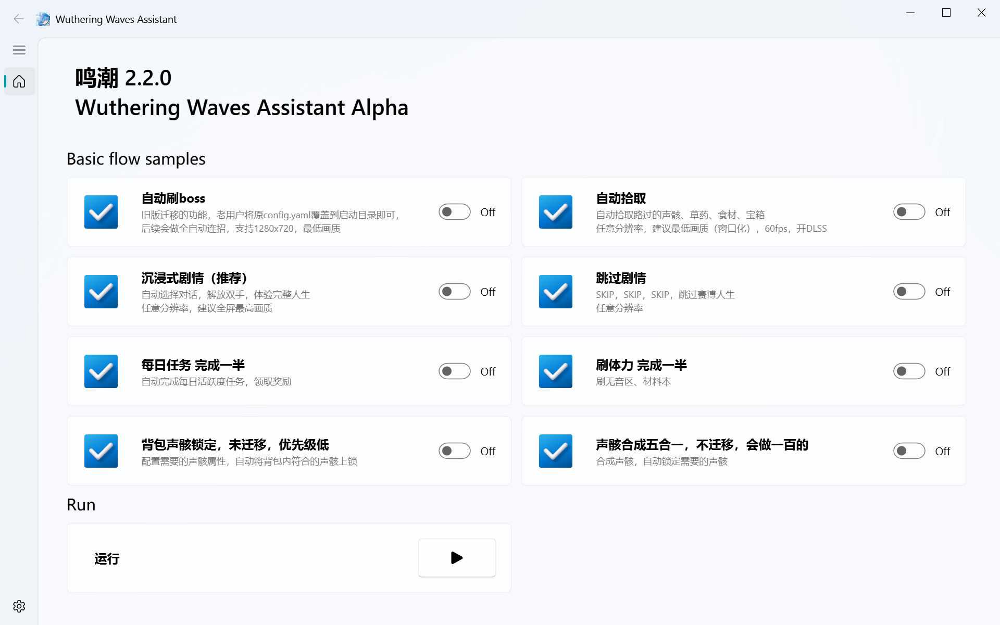

# Wuthering Waves Assistant

鸣潮自动化助手

**QQ群: 1039535103**

---



---

## 📌 使用指南

### 1️⃣ 安装 Conda

群文件里有，或点击 [Miniconda官方链接](https://repo.anaconda.com/miniconda/Miniconda3-latest-Windows-x86_64.exe) 下载 Miniconda，并按照默认设置安装。

### 2️⃣ 安装 Git

前往 [Git 官网](https://git-scm.com/) 下载并安装 Git，全程保持默认设置。

### 3️⃣ 准备环境

- 选择一个**路径中不包含中文**的文件夹来存放本项目。
- **以管理员身份**打开 PowerShell。

### 4️⃣ 下载项目

```powershell
git clone https://github.com/wakening/WutheringWavesAssistant.git

或者使用免费的国内加速代理，任选其一：
git clone https://ghproxy.net/https://github.com/wakening/WutheringWavesAssistant.git
git clone https://ghfast.top/https://github.com/wakening/WutheringWavesAssistant.git
git clone https://gitclone.com/github.com/wakening/WutheringWavesAssistant.git
```

### 5️⃣ 安装依赖


```powershell
设置powershell允许执行脚本，输入 Y 确认
Set-ExecutionPolicy RemoteSigned -Scope CurrentUser
```

```powershell
cd WutheringWavesAssistant
./scripts/rebuild_conda_env.ps1
```

按照提示，输入1 回车 选择GPU环境安装，等待脚本执行完成，执行一次即可，若失败可以重跑  
v2.2.2之前安装过的用户需要再执行一次来安装gpu环境，此前安装的是3 cpu环境

### 6️⃣ 配置文件

- **老用户**（使用过 `mc_auto_boss` 的用户）：请复制 `config.yaml` 到本目录并覆盖。
- **新用户**：修改config.yaml中的DungeonWeeklyBossLevel和TargetBoss后运行。

### 7️⃣ 启动脚本

**务必以管理员身份运行**，否则部分功能可能无法正常工作。

```powershell
# 激活英伟达GPU环境wwa-cuda，cpu则是wwa-cpu
conda activate wwa-cuda
# 运行程序
python main.py
```

### 8️⃣ 更新脚本

```powershell
git pull
```

### 9️⃣ 管理历史环境

```powershell
查看conda里所有的环境:
conda env list

删除历史测试环境(v2.2.2 Alpha之前的版本):
conda remove --name WutheringWavesAssistant --all -y
```

---

## ❓ 常见问题

### ⚠️ 脚本无法运行？
确保 **PowerShell 以管理员身份运行**，并且 Conda 和 Git 均已正确安装。

### ⚠️ 依赖安装失败？
重新运行 `./scripts/rebuild_conda_env.ps1` 以重建环境。

### ⚠️ 运行时报错？
加入我们的 **QQ群 (1039535103)** 交流或提交 Issue 反馈问题。

